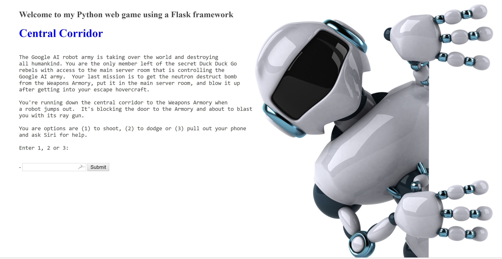

## Python Class Project - Flask Demo using a simple, interactive game

Started from example in Learn Python 3 The Hard Way by Zed Shaw, but refactored code and added features.

Screen shot of home page and start of game:

